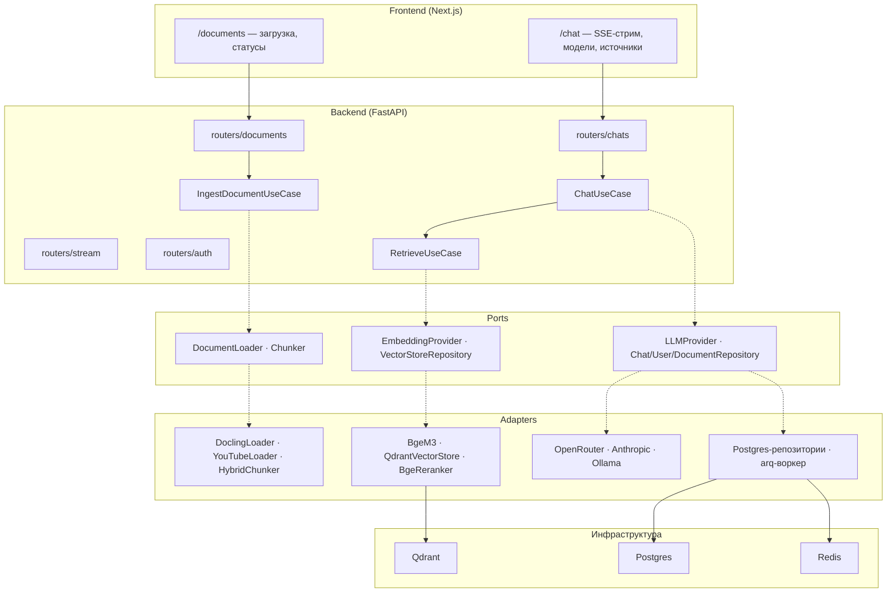

# RAG-ассистент

Retrieval-Augmented Generation система для ответов по документам
из базы знаний: гибридный поиск, реранкинг, выбор LLM-модели, чаты
с персистентностью и мультипользовательский доступ.

Начинали с учебного прототипа, пришли к расширяемой
hexagonal-архитектуре. Легаси-прототип сохранён в `frontend-legacy/`.

---

## Быстрый старт

```bash
git clone git@github.com:AliR005/RAG_base.git
cd RAG_base

cp .env_example .env   # заполнить LLM_MODEL, ключи провайдеров
docker compose up -d   # Qdrant + Postgres + Redis

cd backend
uv sync --group dev
uv run alembic upgrade head
uv run uvicorn app.main:app --host 0.0.0.0 --port 8000

cd ../frontend
npm install
npm run dev            # http://localhost:3000
```

Ingestion-воркер (отдельный процесс):

```bash
cd backend && uv run arq app.worker.WorkerSettings
```

Проверка: `GET http://localhost:8000/health`, `GET /models`.

---

## Архитектура



Composition root — `backend/app/core/container.py`: роутеры получают
готовые use-case'ы через `Depends`, синглтоны `lru_cache` остались только
для легаси-стека. Новый провайдер/загрузчик/БД = один новый адаптер
без изменения остального кода.

---

## Конвейер ответа

1. Вопрос → эмбеддинг `BAAI/bge-m3`.
2. Qdrant: prefetch top-30 по dense- и sparse-векторам (`Qdrant/bm25`),
   фьюжн RRF, фильтр `user_id` на каждый запрос.
3. Реранкинг кандидатов кросс-энкодером `bge-reranker-v2-m3`, top-5
   в контекст.
4. Промпт (`backend/template.yaml`: контекст + история) → выбранная
   модель → настоящий SSE-стрим токенов.
5. Ответ сохраняется с `model_used` и citations (chunk/document/snippet).

**До/после реранкинга:** раньше контекст брался прямым top-2 dense-поиска
без учёта пользователя; теперь гибридный prefetch top-30 + кросс-энкодер
отсеивает лексически похожие, но семантически нерелевантные чанки,
а payload-фильтр изолирует данные пользователей.

---

## Источники

Единая точка входа `POST /documents`: файл (multipart) или
`{"url": "..."}`. `LoaderFactory` выбирает загрузчик:

| Источник | Загрузчик |
|---|---|
| YouTube-ссылка | `YouTubeLoader`: субтитры → markdown с таймкодами; без субтитров — `faster-whisper` |
| Статья/страница/PDF по URL | `DoclingLoader` (URL напрямую) |
| Файл pdf/docx/pptx/xlsx/html/md/изображение | `DoclingLoader` + OCR |

Чанкинг — Docling `HybridChunker`: token-aware под токенизатор `bge-m3`,
заголовки → `title`/`section`, таблицы остаются в markdown.
Ingestion асинхронный (arq + Redis), статусы `pending/processing/done/error`
видны в UI, повторная загрузка без изменений не переэмбеддируется
(дедупликация по SHA-256).

---

## LLM-слой

Порт `LLMProvider.generate(messages, model, stream)`. Адаптеры:
`OpenRouterProvider` (один ключ → десятки моделей, нативный SSE-парсинг),
`AnthropicProvider` (нативный SDK), `OllamaProvider` (локальный fallback).
Реестр `backend/models.yaml` отдаётся через `GET /models` — фронт строит
выпадающий список, выбор модели сохраняется в каждом сообщении.

Переменные окружения (см. `.env_example`, defaults — в
`backend/app/core/config.py`): `HOST`, `PORT`, `LLM_MODEL`,
`EMBEDDING_MODEL`, `COLLECTION_NAME`, `QDRANT_URL`, `DATABASE_URL`,
`REDIS_URL`, `OPENROUTER_API_KEY`, `ANTHROPIC_API_KEY`, `JWT_SECRET`.

---

## API (основное)

| Метод | Путь | Описание |
|---|---|---|
| POST | `/auth/register`, `/auth/login`, `/auth/me` | JWT (access, bcrypt) |
| GET | `/models` | реестр моделей |
| POST/GET/PATCH/DELETE | `/chats`, `/chats/{id}` | CRUD чатов |
| GET | `/chats/{id}/messages` | история (переживает перезагрузку) |
| POST | `/chats/{id}/messages` | SSE-ответ + сохранение citations (лимит 30/мин) |
| POST | `/documents`, `/documents/upload` | файл/URL/YouTube → очередь |
| GET/DELETE | `/documents`, `/documents/{id}` | статусы, удаление (+ чанки в Qdrant) |
| POST | `/query/`, `/query/stream` | легаси-маршруты прототипа |

Каждый ответ включает `X-Request-ID`, логи — JSON через structlog.

---

## Почему этот стек

- **Qdrant**: именованные dense+sparse векторы и RRF-фьюжн
  из коробки, payload-индексы для фильтрации по пользователю.
- **bge-m3 + bge-reranker-v2-m3**: сильный мультиязычный retrieval
  (включая русский), dense и sparse одним проходом.
- **Docling**: token-aware чанкинг со структурой, таблицы, OCR
  и десятки форматов вместо ручного сплита по маркерам.
- **OpenRouter**: один ключ даёт выбор из десятков моделей прямо в UI.
- **arq + Redis**: транскрипция видео и парсинг PDF не блокируют API.
- **Next.js вместо Streamlit**: персистентные чаты, SSE-стриминг,
  классический под найм фронтенд-стек.

Масштабирование: одна коллекция Qdrant с `user_id` в payload проще
в эксплуатации; при росте числа тенантов — переход на collection
per tenant (заметка, не реализовывать заранее).

---

## Разработка

```bash
uvx ruff@0.9.10 check backend
uvx ruff@0.9.10 format --check backend
uv run pytest -q                        # 45 unit+contract, live — RAG_LIVE=1
RAG_LIVE=1 uv run pytest backend/tests/integration/test_live.py -q
cd frontend && npm run typecheck && npm run build
```

CI (`.github/workflows/ci.yml`): ruff + pytest на slim-зависимостях
(тяжёлые импорты torch ленивые — CI идёт ~минуту), typecheck
и build фронта. Live-тесты Postgres/Qdrant — только локально
(`RAG_LIVE=1`, нужен `docker compose up`).

Структура: `backend/app/{domain,ports,application,adapters,api→routers,core}`,
`backend/alembic`, `backend/tests/{unit,integration}`, `frontend/app`,
`eval/` (RAGAS golden-сет). Детали по итерациям — `AGENTS.md`.
